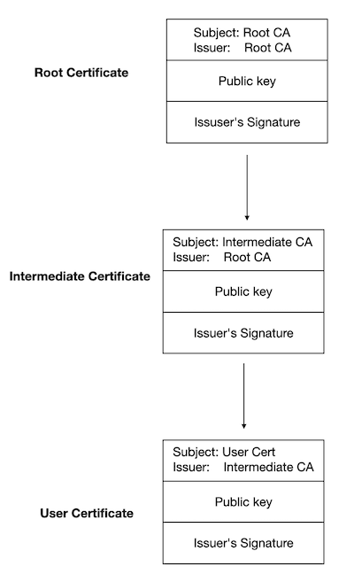

# 证书生成

## OpenSSL  

`OpenSSL`常见命令

- genrsa
- ca
- req
- x509
- crl
- ec
- ecparam
- enc

`OpenSSL`配置文件位于`/etc/ssl/openssl.cnf`.
`openssl.conf` 中的配置包含多个段落 (`sections`)，可以互相引用，`openssl` 的 `ca` 和 `req` 两个命令会引用对应名称的段落，比如 `ca` 命令会引用 `[ca]` 段落，而 `req` 命令会引用 `[req]` 段落。  

```text
####################################################################
[ ca ]
default_ca	= CA_default		# The default ca section

####################################################################
[ CA_default ]

dir		= ./demoCA		# Where everything is kept
certs		= $dir/certs		# Where the issued certs are kept
crl_dir		= $dir/crl		# Where the issued crl are kept
database	= $dir/index.txt	# database index file.
#unique_subject	= no			# Set to 'no' to allow creation of
					# several certs with same subject.
new_certs_dir	= $dir/newcerts		# default place for new certs.

certificate	= $dir/cacert.pem 	# The CA certificate
serial		= $dir/serial 		# The current serial number
crlnumber	= $dir/crlnumber	# the current crl number
					# must be commented out to leave a V1 CRL
crl		= $dir/crl.pem 		# The current CRL
private_key	= $dir/private/cakey.pem# The private key

x509_extensions	= usr_cert		# The extensions to add to the cert
```

### 创建三级证书体系  

想要的证书体系主要包含三个组成部分：Root CA Certificate, Intermediate CA Certificate, 以及 User Certificates，完整证书链如下：


#### 创建 Root CA证书

```shell
mkdir -p rootCA && cd rootCA
mkdir -p demoCA newcerts private
touch demoCA/index.txt
echo -ne "00" > demoCA/serial
echo -ne '00' > demoCA/crl
```

使用 openssl 命令来创建 Root CA 证书：

- 证书名字模仿主流权威机构起名 (Common Name) 为 FactTrust Root CA
- 有效期 20 年
- 私钥算法和长度：RSA:4096 （默认 2048)
- 摘要签名算法：SHA256 (默认 SHA256)
- 密钥是否加密：不加密

```shell
openssl req -x509 -newkey rsa:4096 -sha256 -days 7300 -nodes \
  -keyout Trust_Root_CA.key -out Trust_Root_CA.crt \
  -subj "/C=CN/ST=FJ/L=FZ/O=Security/OU=IT Department/CN=Trust Root CA" \
  -addext keyUsage=critical,cRLSign,keyCertSign,digitalSignature \
  -addext basicConstraints=critical,CA:true,pathlen:3
```

或

```shell
openssl genrsa -out Trust_Root_CA.key 4096 
openssl req -sha256 -new -x509 \
    -days 7300 \
    -key Trust_Root_CA.key \
    -out Trust_Root_CA.crt \
    -subj "/C=CN/ST=FJ/L=FZ/O=Security/OU=System/CN=Trust Root CA" \
    -addext keyUsage=critical,cRLSign,keyCertSign,digitalSignature \
    -addext basicConstraints=critical,CA:true,pathlen:3
```

#### 创建 Intermediate CA 证书

TODO

#### 创建User/Leaf证书


## References

- [使用 OpenSSL 构建 X.509 三级证书体系](https://mp.weixin.qq.com/s?__biz=MzI1NjExNDEzMQ==&mid=2247484926&idx=1&sn=9c60d0e6994b5edfaa9b8a20ea51db4e&chksm=ea2ae942dd5d6054d5ac55e27d488f869dc5066b13b301dea1be7432cdcd08a28d7ba4d2bee7&scene=178&cur_album_id=2331755767839866880#rd)